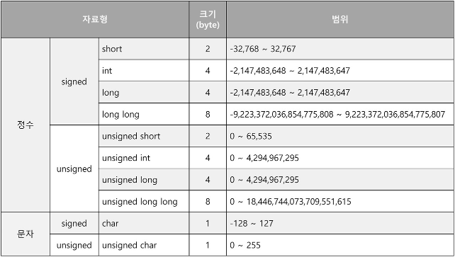
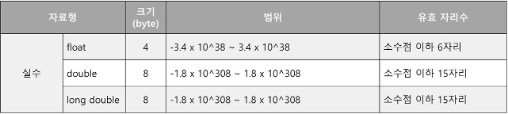
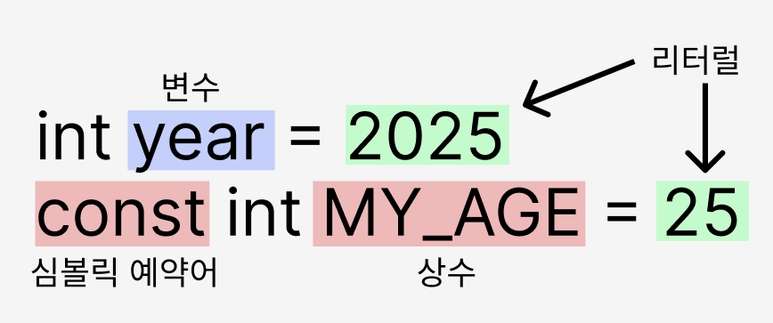

# IoT-C-2025
IoT 개발자 C 기초 프로그래밍 언어 리포지토리

## 1일차

> **C 언어는 함수로 시작해서 함수로 끝이 난다**

- C 언어
    - 1972년에 벨 연구소(Bell Labs)의 데니스 리치가 만든 범용(general-purpose) 프로그래밍 언어.
    - C언어의 기본단위는 **함수**
    - 프로그램이 시작되면 main 함수가 호출된다. 리터럴(상수)
    - 함수 내에 존재하는 문장의 끝에는 세미콜론(;)을 붙여준다.
- 함수
    - 함수에는 입력과 출력이 존재한다.
    - 함수의 기능은 중괄호 안에 표현, 표현된 함수의 기능을 함수의 몸체라고 한다.
    - 함수 표현 3가지
        1. 함수의 이름
        2. 출력형태(return type)
        3. 입력형태


    - 함수관련 용어
        - **함수의 정의**: 만들어진 함수, 실행이 가능한 함수
        - **함수의 호출**: 함수의 실행을 명령하는 행위
        - **인자의 전달**: 함수의 실행을 명령할 때 전달하는 입력 값
    
- C 언어 기본 틀
```c
#include <stdio.h>    

int main() {

	return 0;
}
```

```c
#include <stdio.h>

void main() {

}
```
[Q1.int main() 과 void main() 의 차이?](Questions.md#q1-int-main과-void-main의-차이)
- 주석
	- `//` : 한 줄 주석
	- `/**/` 여러 줄 주석
- 문자열 출력


파이썬 문자열 치환방법과 비슷함. 차이는 `%()` 로 감싸지 않아도 된다는 것

- 아스키코드(ASCII)
    - 아스키코드표
    

    - 미국 표준 협회에 의해 제정된 코드
    - 컴퓨터는 문자를 표현 및 저장하지 못함 -> 문자 표현 목적으로 각 문자에 고유한 숫자 지정
    - 따라서 인간이 입력하는 문자는 해당 문자의 숫자로 변환되어 컴퓨터에 저장 및 인식


- 변수
    - 값을 저장할 수 있는 메모리 공간
    - 변수가 선언시, 메모리 공간이 할당되고 할당된 메모리 공간에 이름이 붙는다.
    - 변수 이름을 통해 값 저장, 값 참조 할 수 있다.
    - 할당: `int num;`
    - 초기화: `num = 10;`
    - 할당과 초기화 동시에 할 수도 있다. `int num = 10;`
    - 변수 선언만 하면 값이 대입되기 전까지 쓰레기 값이 채워진다.

- 자료형
    - 정수형 변수(char, short, int, long)
      
    
    - 실수형 변수(float, double)
    

    📌 컴퓨터가 가장 연산을 빨리 할 수 있는  크기 4byte
  
    📌 변수 앞의 자료형은 메모리의 크기를 나타내준다.
  
    📌 double이 정밀도가 더 높음 (8바이트)
  - float(단정밀도, 32비트)
  	- 최대 소수점 약 6~7자리까지 정확하게 표현 가능.
   	- 7자리 이후의 값은 반올림되거나 오차 발생. 
  - double (배정밀도, 64비트)
  	- 최대 소수점 약 15~16자리까지 정확하게 표현 가능.
   	- float보다 훨씬 더 정확한 값을 저장 가능.

 - 연산자
 📢 삼항 연산자부터는 파이썬에 없는 연산자
    - 대입연산자(`=`)
    - 산술연산자(`+`, `-`, `*`, `/`, `%`)
    - 복합 대입 연산자(`+=`, `-=`, `*=`, `/=`, `%=`)
    - 관계연산자(`<`, `>`, `>=`, `<=`, `!=`, `==`)
    - 논리 연산자(`&&`, `||`, `!`)
    - 증감연산자(`++`, `--`)
    - 삼항 연산자(`?:`)
    - 비트 연산자(`&`, `|`, `^`, `~`, `<<`, `>>`)
    - 주소 및 포인터 관련 연산자(`&`, `*`)
    - 구조체 관련 연산자(`.`, `->`)
    - sizeof 연산자(`sizeof`)
    - 형 변환 연산자(`(type)`)

    - 연산자 우선순위
- 상수
    - 리터럴 상수
    이름이 존재하지 않으며, 변경이 불가능한 상수  
    대문자 표기, 둘 이상의 단어일때 `_`로 표기가 관례
        - 정수: 기본적으로 int형으로 표현 
        - 실수: 기본적으로 double형으로 표현
        - 문자: 기본적으로 int형으로 표현
    - 심볼릭 상수 
        - const 예약어를 붙인 상수는 이후 값 변경이 불가능하다

    

## 2일차
- 연산자
    - **&**
        - 비트연산자 `A & B` A와 B의 비트 연산 실행
        - 논리연산자 `A && B` A와 B의 AND 연산 실행
        - 주소연산자 `&A`A의 주소값 반환
    비트와 논리 연산자 헷갈림 주의!!!

    - **~**
        - 비트연산자: NOT (0은 1로, 1은 0으로)
    - **^**
        - 비트연산자: XOR (다르면 1, 같으면 0) 

- 형변환 (Type Conversion)  
	상황에 따라, 필요에 따라 자료형이 다른 것으로 변환되는 것.</br>
	자동으로 형 변환이 일어나는 **묵시적 형변환**, 개발자가 직접 형 변환을 지정하는 **명시적 형변환**이 있다.
 
    - 묵시적 형변환(Implicit Type Conversion)
        - 컴파일러가 자동으로 변환
        - 더 큰 크기, 더 높은 정밀도의 데이터 타입으로 변환  
        (char → int → float → double 순서)  
	
    - 명시적 형변환(Explicit Type Conversion)
        - 개발자가 직접 변환 지정
        - `(데이터타입) 값` 형태 변환

- 제어문
C 언어에서는 들여쓰기가 아닌 {} 중괄호로 구분
    - 선택 제어문 (if, switch)
        - if 문: elif 가 아닌 else if, 나머진 파이썬과 동일 
        - switch문: 파이썬에는 없음  
        switch(`값`) 에는 정수형만 들어갈 수 있음
        ```c
        int num;
        switch(num) {
        case 1:

        case 2:

        default:	// 생략가능
        }
        ```


    - 반복 제어문 (for, while, do-while)
        - for 문
            - for(초기화; 조건; 증감)
            - range() 함수 x
            - 각각의 항목을 `;`로 구분
        
        - while 문: 파이썬과 같음

        - do-while 문: 파이썬에는 없음
            - do 안에 있는 문장 반드시 한 번은 실행됨 (이후 조건 확인)  
        ```c
        do {

        } while(조건);
        ```
- 함수
    - 함수 선언, 함수 정의, 함수 호출 용어 알기
    - main() 함수 앞에 함수 선언 해주기(가독성, 오류 방지)  
    `반환형 함수명(실인자);` 형식으로 선언
    - main() 함수 뒤에는 함수 정의 ({}안에 내용 채우기)
    - 여러 인자 return 불가 (파이썬과 차이)
    - return 에서 연산 불가 (파이썬과 차이)
    - 실습: [계산기 만들기](./Day02/c08.calc.c)
        - [Q2. scanf 함수의 서식 지정자로 인해 받는 데이터의 타입이 결정되는가?](Questions.md#q2-scanf-함수의-서식-지정자로-인해-받는-데이터의-타입이-결정되는가)
        - [Q3. 공백을 무시하는 형식지정자?](Questions.md#q3-공백을-무시하는-형식지정자)
        - [Q4. char을 %d로 출력하는 건 되는데, %d로 입력하는 건 왜 안 됨??](Questions.md#q4-char을-d로-출력하는-건-되는데-d로-입력하는-건-왜-안-됨)


## 3일차
- 배열
다수의 변수선언을 용이하게 하기 위함
1차원, 2차원 형태로 선언할 수 있음
    - 배열의 이름은 배열의 첫 번째 주소이다.
    - for문을 통해 제어한다.
    - arr[1] == *(arr + 1) 과 같은 의미
    - 배열 크기를 선언할 시 안에 변수를 넣을 수 없음
        - malloc 함수 사용 or 상수로

- 포인터
    - 포인터 변수?
        주소값 저장을 목적으로 선언되는 것
    - 형태
    ```c
    // 타입* 변수명;
    // 예시
    int* ip;        // int형 포인터 변수
    double* dp;     // double형 포인터 변수
    double * dp2;
    double *dp3;    // *의 위치는 상관없음 `포인터 변수` 라는 의미
    ```
    특정값으로 초기화 하지 않는 경우에는 널 포인터로 초기화 하는 것이 안전
    `int* ptr1 = 0` OR `int* ptr2 = NULL`


    - swap 함수 
        - C 에서는 `a, b = b, a`의 문법이 존재하지 않음
        - 함수로 구현했을 경우 포인터 인자로 받아오면 값이 직접적으로 변경되지 않음, 함수 내에서만 변경됨

- const
    - `int* const p = &a` - 포인터 상수
        - 주소 변경 불가, 값 변경 가능
    - `const int* p = &a` - 데이터 상수
        - 값 변경 불가, 주소 변경 가능
    - `const int* const p = &a`
        - 데이터, 포인터 모두 변경불가
- 문자
    - `%c` - 개행문자도 그대로 읽어옴
    - scanf()에서 개행 문자 무시하고 싶을 때 `scanf( %c %c, &n1, &n2)` _%c 앞에 **공백**
    - getchar(), putchar(): 문자 전용 함수
        - getchar() 한 문자를 읽어오는 함수
        - putchar() 한 문자를 출력하는 함수
        - 응용 : `while(getchar() != '\n');` 남아 있는 모든 문자 제거 

    - 대/소문자 변환
        - 아스키 코드 이용: A:65, Z: 90, a: 97, z: 122